  

## 📌 About Me
- Currently building AI-powered and full-stack development projects
- Learning advanced AI integrations, scalable architectures, and automation systems
- Interested in Artificial Intelligence, Generative AI, and intelligent software systems
- Focused on AI-assisted full-stack development and rapid prototyping
- Exploring data analysis, visualization, and real-time telemetry systems
- Passionate about building scalable, secure, and user-centric applications
- Working with Python, JavaScript, React, Node.js, APIs, and modern web technologies
- Interested in automation and performance optimization
- Continuously learning AI development practices
- Open to collaborating on innovative AI and software development projects

## 🧠 My Focus Areas
- Python
- Artificial Intelligence and Generative AI
- AI-Assisted Full-Stack Development
- Machine Learning and LLM Applications
- Data Analysis
- Data Visualization
- Automation Systems
- Real-Time Telemetry Systems
- Performance Optimization
- Modern UI/UX Development
- Cloud and Intelligent Applications
- Problem Solving and Algorithmic Thinking

## 📊 GitHub Stats & Trophies

  

## 🛠️ Languages & Tools

<h3 align="center">Frontend</h3>

  &nbsp;
  &nbsp;
  &nbsp;
  &nbsp;
  

<h3 align="center">Backend</h3>

  

<h3 align="center">Database</h3>

  

<h3 align="center">Tools</h3>

  &nbsp;
  &nbsp;
  

  

 

## 🔗 Connect with Me

  &nbsp;&nbsp;
  

  

  

